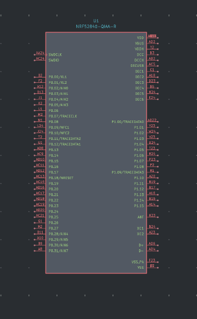
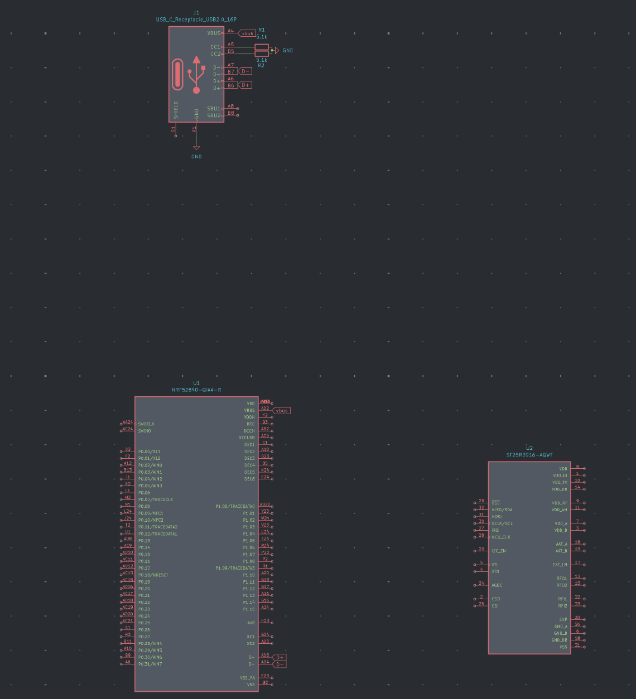
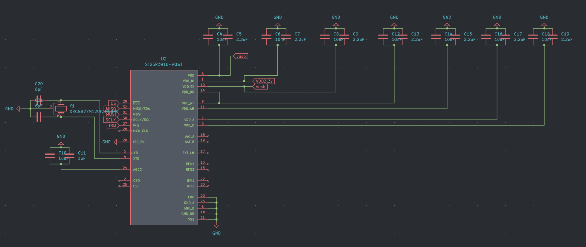
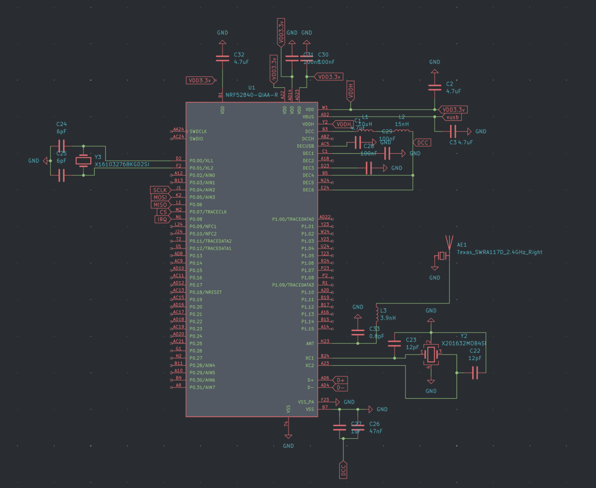

## 6/1/25 
Came up with the initial idea and some basic plans. I did research on the NRF-52 series and found out that it alone wasn't sufficient for what I wanted to build, so I needed a separate chip. After searching online, I found that the PN532 was a popular choice since it was cheap and widely available, but the PN533 might have more features.  
 
Since I settled on using the NRF-52840-QIAA-R as the main microcontroller I created a new KiCad project and imported the schematic and footprint. 
 
 
Screenshot of KiCad NRF-52840-QIAA-R schematic
 
 
**Time spent today: 2h** 
**Total time spent: 2h**
## 6/4/25
After further research and looking at what JLCPCB has, the ST25R3916-AQWT may be a better pick for the reader chip. It's cheaper than the PN532, a bit newer, and can do a bit more too. Although it is capable of tag emulation, it doesn't seem as capable as the NRF52, so a dual chip setup is still needed.  
 
A future problem I will need to deal with is the antenna setup. I will need a way to connect both chips to the antennas using a switching method so there isn't any interference. 
 
In KiCad, I imported the ST25R3916-AQWT symbol and schematic and connected up the NRF52 to a USB-C port. 
 
 
Screenshot of current KiCad progress 
 
**Time spent today: 2h** 
**Total time spent: 4h**
## 6/6/25
Spent today connecting up the ST25 to the NRF52 using SPI and making some other connections for the ST25. SPI was a bit confusing at first because the CS pin was labeled BSS, and I thought it was the CSO and CSI pins for a bit. Looking at diagrams online, most people are wiring up the ST25 with 5v on the VDD and VDDTX pins and 3.3v on the VDDIO pin, so I went with that (pulled 5v from usb and 3.3v from the NRF VDD output). The ST25 also needed a 27.12 MHz oscillator, so I used the XRCGB27M120F3M00R0 (terrible name). Finally, I decoupled everything on the ST25 (hopefully properly).  
 
The next update will probably be finishing up the wiring for the NRF52. After that I will work on figuring out the antenna setup. Also decided to ditch the battery. 
 
 
Screenshot of the current ST25 schematic (if you see any problems please message me, thanks) 
 
**Time spent today: 3h** 
**Total time spent: 7h**
## 6/29/25
Got back from vacation. Spent today wiring up the NRF52. I got all the decoupling, fixed the symbol, added a BLE antenna, and added the two oscillators (32 Mhz & 32.768 KHz). Everything looks very sketchy so far and I have no idea if it will work at all. 
 
I will try to get the NFC antennas figured out for the next update and also add the buttons. 
 
 
Screenshot of the almost completed NRF52 schematic (as usual please message me if you see any problems) 
 
**Time spent today: 5h** 
**Total time spent: 12h**