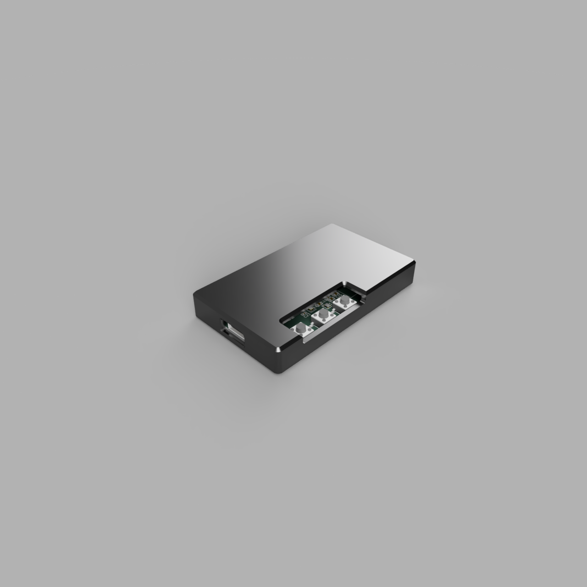
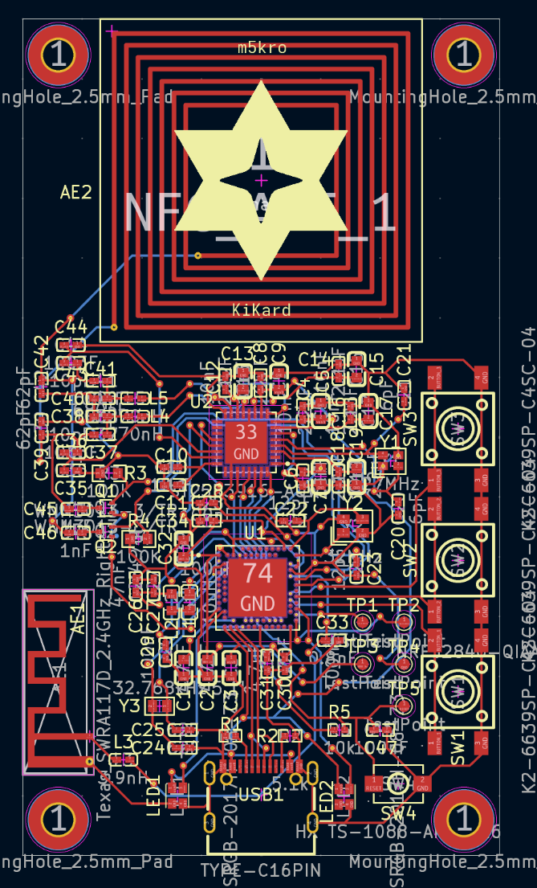

# Total Time
50 hours

## 6/1/25 
Came up with the initial idea and some basic plans. I did research on the NRF-52 series and found out that it alone wasn't sufficient for what I wanted to build, so I needed a separate chip. After searching online, I found that the PN532 was a popular choice since it was cheap and widely available, but the PN533 might have more features.  
 
Since I settled on using the NRF-52840-QIAA-R as the main microcontroller I created a new KiCad project and imported the schematic and footprint. 
 
 
Screenshot of KiCad NRF-52840-QIAA-R schematic
 
 
**Time spent today: 2h** 
**Total time spent: 2h**
## 6/4/25
After further research and looking at what JLCPCB has, the ST25R3916-AQWT may be a better pick for the reader chip. It's cheaper than the PN532, a bit newer, and can do a bit more too. Although it is capable of tag emulation, it doesn't seem as capable as the NRF52, so a dual chip setup is still needed.  
 
A future problem I will need to deal with is the antenna setup. I will need a way to connect both chips to the antennas using a switching method so there isn't any interference. 
 
In KiCad, I imported the ST25R3916-AQWT symbol and schematic and connected up the NRF52 to a USB-C port. 
 
 
Screenshot of current KiCad progress 
 
**Time spent today: 2h** 
**Total time spent: 4h**
## 6/6/25
Spent today connecting up the ST25 to the NRF52 using SPI and making some other connections for the ST25. SPI was a bit confusing at first because the CS pin was labeled BSS, and I thought it was the CSO and CSI pins for a bit. Looking at diagrams online, most people are wiring up the ST25 with 5v on the VDD and VDDTX pins and 3.3v on the VDDIO pin, so I went with that (pulled 5v from usb and 3.3v from the NRF VDD output). The ST25 also needed a 27.12 MHz oscillator, so I used the XRCGB27M120F3M00R0 (terrible name). Finally, I decoupled everything on the ST25 (hopefully properly).  
 
The next update will probably be finishing up the wiring for the NRF52. After that I will work on figuring out the antenna setup. Also decided to ditch the battery. 
 
 
Screenshot of the current ST25 schematic (if you see any problems please message me, thanks) 
 
**Time spent today: 3h** 
**Total time spent: 7h**
## 6/29/25
Got back from vacation. Spent today wiring up the NRF52. I got all the decoupling, fixed the symbol, added a BLE antenna, and added the two oscillators (32 Mhz & 32.768 KHz). Everything looks very sketchy so far and I have no idea if it will work at all. 
 
I will try to get the NFC antennas figured out for the next update and also add the buttons. 
 
 
Screenshot of the almost completed NRF52 schematic (as usual please message me if you see any problems) 
 
**Time spent today: 5h** 
**Total time spent: 12h**
## 7/9/25
Spent today figuring out the NFC antenna. This took forever and really confused my brain, as I have no idea how RF works. After spending hours looking at documentation and performing calculations, I settled on a 25x25mm antenna with 7 turns, 0.4mm width traces, and 0.6mm spacing, to get around 1.37uH of inductance. 1.37uH is sort of a magic number because it simplifies all the tuning calculations for me. For the ST25 everything was already done for me since the flipper zero just so happens to use the same chip, and its antenna is also 1.37uH (thanks Flipper Zero team). The NRF52 was a bit harder since I needed to perform my own calculations, but thankfully, it came out to just around 200pF for each tuning capacitor. 
 
Next update I will get more of the schematic done and maybe figure out the mux (switching mechanism) for the antenna. 
 
 
Screenshot of the NFC antenna footprint (created using: https://github.com/nideri/nfc_antenna_generator) 
 
**Time spent today: 5h** 
**Total time spent: 17h**
## 7/11/25
Finished up the NFC tuning for the ST25 today. I also sort of figured out a switching mechanism for the NRF52. It involves 2 mosfets to control when the NRF52 connects, and it attaches right onto the coil. It's an ugly solution and there's a good chance it doesn't work because the NRF52 can't quite be tuned in this setup. However, [some people online claim they have been able to get away with not tuning by using a MOLEX 1462360051 antenna](https://forum.seeedstudio.com/t/xiao-nrf52840-nfc-antenna-insights/277696), which happens to be 1.4uF (very close to my 1.37). I'll do more research later to see if this configuration actually works. 
 
Next update will (hopefully) be starting on the PCB layout. 
 
 
Screenshot of the terrible antenna switching mechanism and the ST25 tuning 
 
**Time spent today: 4h** 
**Total time spent: 21h**
## 7/14/25
Added the buttons, leds, and fixed some small stuff. I also spent most of the time finding footprints and actual parts on JLCPCB. The BOM took forever to do and I triple checked everything on the schemtics to make sure designing the PCB would be as smooth as possible. 
 
Next update I will be starting on the PCB. 
 
 
Screenshot of the superlong BOM 
 
**Time spent today: 4h** 
**Total time spent: 25h**
## 7/16/25
Started on the PCB! Currently have the usb and buttons wired up. Still working on getting the 3.3v output from the NRF52. I may need to expand the board in case I can't fit all the caps. 
 
Next update will be more of the PCB. 
 
 
Screenshot of the current PCB progress 
 
**Time spent today: 3h** 
**Total time spent: 28h**
## 7/17/25
Spent today wiring up most of the NRF52, just have the NFC and SPI connections left to do. Some minor modifications had to be made to the schematic due to some of the GPIO pins on the NRF52 being "slow speed". I'm also worried about the spacing for the ST25 as all the caps need to be squeezed into a sort of line. 
 
Next update will (hopfully) be the finished PCB. 
 
 
Screenshot of the current PCB progress 
 
**Time spent today: 5h** 
**Total time spent: 33h**
## 7/18/25
Finished the PCB! I also generated the gerbers and position files to see how much it would cost on JLCPCB. I ran into some issues initially where the vias wern't showing up but I fixed it by reading JLCPCB's documentation. I didn't realize some parts were standard PCBA only so I had to switch them out for different ones (the RGBLEDs and 62pF caps). I also found out about the "extended" parts fee and that really hurt to look at. I can still get the 5 boards just under $150 though, so it'll be around $30 per board. There's not much left to do but create a case and write some initial test code. 
 
Next update will be the case and some code. 
 

 
Screenshot of the final PCB layout and 3D render 
 
**Time spent today: 7h** 
**Total time spent: 40h**
## 7/21/25
Created a case for the PCB. It's got curved and chamfered edges to be comfortable to hold and nice to look at. Instead of screw holes I opted to design some internal clips so it's much easier to assemble and take apart. The buttons on the side are exposed, mostly because I think it looks good but also because I was too lazy to design extensions in the case. There was a small issue where the button hight was incorrect which I had to manually fix but otherwise everything looks ok. 
 
I'll start working on the test code next. 
 

 
Screenshot of the rendered case and fixed PCB 
 
**Time spent today: 5h** 
**Total time spent: 45h**
## 7/25/25
Created a test application today! During my reseach for the NRF connect SDK I found out that the chip does not come with a bootloader by default. Because of this, I needed to add some testpads onto the board and I also need to buy a flasher to add the bootloader. This thankfully wans't too hard as there was just enough space to squeeze in the pads without moving any existing components. I also learned about how to use the SDK and exentions to compile a uf2 firmware file. It should now be ready to be shown off at the pitstop and submitted! 
 
Next update I will hopefully have the boards. 
 

 
Screenshot of updated board (new testpads are marked) 
 
**Time spent toay: 5h** 
**Total time spent: 50h**